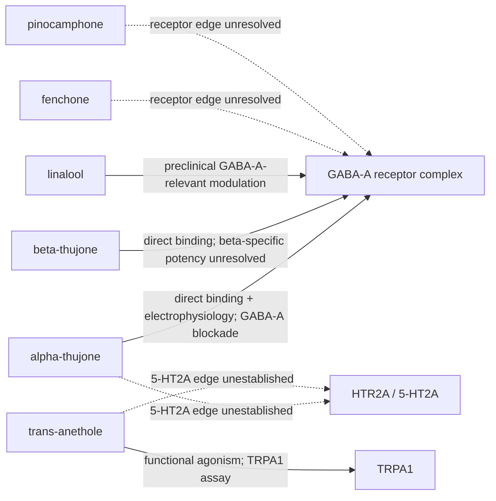

# Initial absinthe–human terpene receptor interactome

## Scope

This is an evidence-qualified network, not a target-fishing result. Nodes are exact or explicitly unresolved absinthe compounds and human neural or sensory-neural receptor systems. Edges preserve whether the source reports direct binding, functional activity, a preclinical modulation result, or only an unresolved hypothesis.

## Current network

## Interpretation

The network contains two materially different biological stories. Thujones have direct evidence for GABA-A channel modulation and toxicological excitation, while trans-anethole has direct evidence at the sensory-neural TRPA1 receptor. Linalool has preclinical GABA-A-relevant literature but requires exact-isomer and concentration reconciliation. None of these edges establishes classic psychedelic pharmacology. The HTR2A dashed edges are unresolved tests, not negative assay results.

## Limitations

SAIR name and exact-SMILES searches returned no rows for the tested absinthe compounds through the public tabular API, even though the broader Terpedia KB returned HTR2A and GABA receptor target records. The SAIR interaction projection is not exposed through the documented tabular source selector, and direct BigQuery querying requires a role not available to the current account. Therefore, the network is a transparent first release: it includes literature-supported edges and records the missing SAIR join rather than treating missing access or missing annotation as absence.

## Next analysis

Obtain the SAIR interaction CSV or a read-only BigQuery role, canonicalize all exact GCP SMILES, join by structure, and append assay endpoint, potency, units, protein ID, source release, manifest URI, and hash. Rank edges only after separating direct assays from docking and target-prediction records. Then compare estimated human plasma or brain exposure with assay concentrations.

