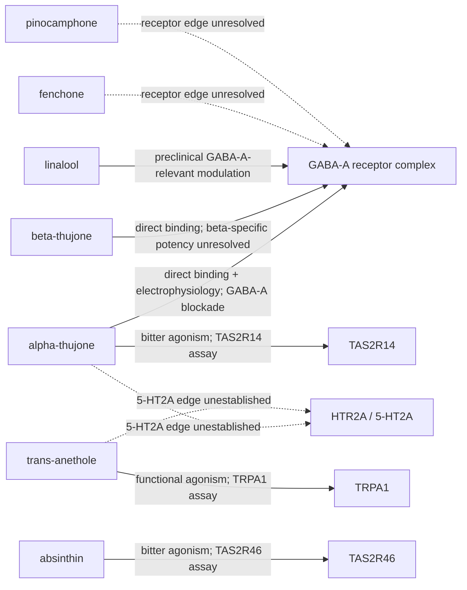

# Absinthe compound–human neural and GI-target evidence map

## Scope

This is an evidence-qualified map, not a target-fishing result or a comprehensive interactome. Nodes are exact or explicitly unresolved absinthe compounds and human neural or sensory-neural target systems. Edges preserve whether the source reports direct binding, functional activity, a preclinical modulation result, or only an unresolved hypothesis.

## Current network

## Interpretation

The map contains three materially different biological stories. Thujones have direct evidence for GABA-A channel modulation and toxicological excitation, alpha-thujone has human TAS2R14 bitter-receptor evidence, and trans-anethole has direct evidence at the sensory-neural TRPA1 receptor. Absinthin, a nonvolatile wormwood constituent listed in the Terpedia profile, has human TAS2R46 agonist evidence in cellular studies. Linalool has preclinical GABA-A-relevant literature but requires exact-isomer and concentration reconciliation. None of these edges establishes classic psychedelic pharmacology. The HTR2A dashed edges are unresolved tests, not negative assay results.

## Mixture-level modulation interpretation

Across the full 29-compound inventory, the evidence tiers are:

| Tier | Inventory members | What may be modulated | Boundary |
|---|---|---|---|
| Directly characterized or isomer-qualified | alpha-thujone, thujone fraction, trans-anethole, absinthin | GABA-A inhibitory tone/excitability; TAS2R14/TAS2R46 bitter chemosensing; TRPA1 sensory signaling | These are non-5-HT2A mechanisms; beta-thujone-specific potency, absinthin exposure, and preparation-level effects remain incomplete |
| Preclinical candidate | linalool | GABA-A-relevant inhibitory tone | Direction, exact isomer, potency, metabolism, and CNS exposure remain unresolved |
| Unresolved comparator | fenchone, pinocamphone | Possible GABA-A-linked neurotoxicity | A comparator hypothesis is not an observed receptor interaction |
| No qualifying edge located | 20 volatile inventory entries, excluding the tiers above | Unknown | A no-join or literature gap is not evidence of biological inactivity |
| Unassessed nonvolatile fraction | artabsin, rosmarinic acid | Unknown | These were listed in the Terpedia profile but were not resolved in the receptor map |

The corresponding one-row-per-inventory-compound assignments are in `data/psychedelic-modulation-map.csv`. The map is intended to answer “what might modulate?” at the level justified by the evidence: alpha-thujone and the thujone fraction may alter inhibitory tone and bitter chemosensing, absinthin may activate TAS2R46, trans-anethole may alter sensory signaling, and linalool may be an inhibitory-tone modifier. It does not support claims of additivity, synergy, brain exposure, or a classic psychedelic state. No supported direct HTR2A edge was located in the searched Terpedia/SAIR releases and retained literature; the alpha-thujone and trans-anethole HTR2A rows are unresolved target tests only.

## Limitations

SAIR name and exact-SMILES searches returned no rows for the tested absinthe compounds through the public tabular API, even though the broader Terpedia KB returned HTR2A and GABA receptor target records. The SandboxAQ `sair.parquet` contains 8,803,710 rows and was queried with DuckDB over authenticated HTTP ranges. The content-addressed Terpedia interaction projection contains 1,489 rows, 397 protein IDs, and 907 unique structures. RDKit canonicalization across 36 unique compound-SMILES records representing all 29 inventory compounds yielded zero isomeric or non-isomeric matches in the projection. The full parquet query, using an explicit Terpedia-to-UniProt protein crosswalk, scanned 136,025 compatible protein rows for 19 human targets and yielded 684 structure–target combinations (36 structure records × 19 targets) with zero exact structure matches. The trans-sabinyl acetate SMILES is explicitly a supplemental crosswalk keyed to a Terpedia systematic name because the native EssoilDB row has no structure field. This remains a release-level join result because gamma-himachalene still lacks sample-specific stereoisomer assignment and SAIR may contain a different structure representation or missing compound. Direct BigQuery querying remains unavailable to the current account. Therefore, the map is a transparent first release: it includes literature-supported edges and records the SAIR join result rather than treating missing annotation as biological absence. Results are in `data/sair-expanded-join-summary.csv`, `data/sair-19-target-parquet-join.csv`, and `data/terpedia-resolved-structure-records.csv`; retrieval and schema metadata are in `data/sair-release-metadata.json`.

## Next analysis

Obtain the SAIR interaction CSV or a read-only BigQuery role, canonicalize all exact GCP SMILES, join by structure, and append assay endpoint, potency, units, protein ID, source release, manifest URI, and hash. Rank edges only after separating direct assays from docking and target-prediction records. Then compare estimated human plasma or brain exposure with assay concentrations.
